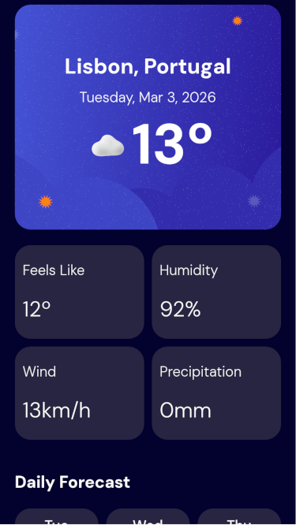
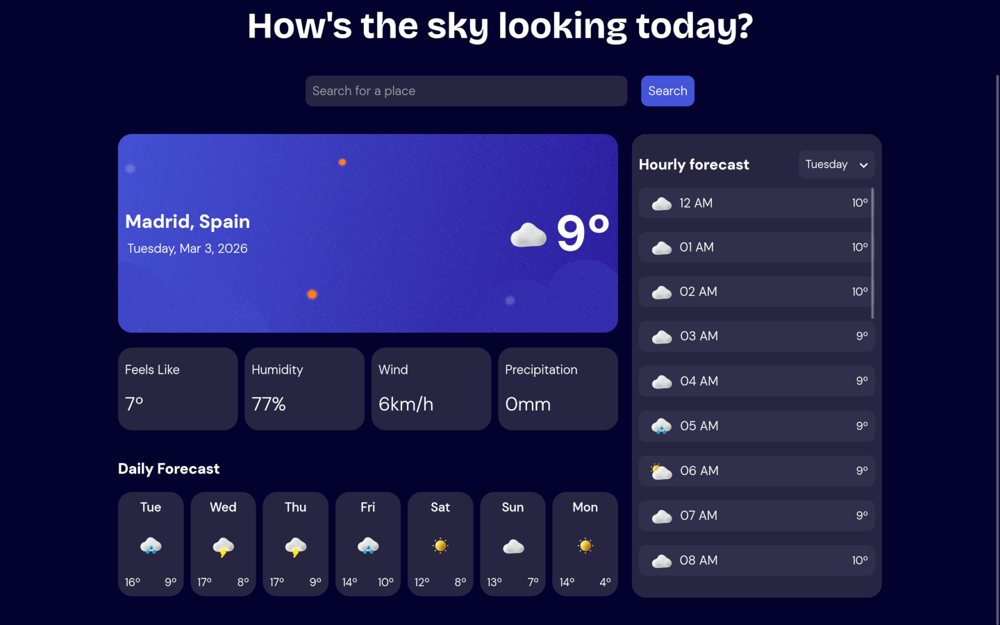

# Weather Now

Weather application built with React and TypeScript, featuring real-time data, runtime validation and an accessible interface.

🔗 **Live Demo:** https://weather-now-app123.netlify.app

---

## 🚀 Key Features

* Search weather by location
* Current conditions (temperature, humidity, wind, precipitation)
* 7-day forecast and hourly breakdown
* Unit switching (Celsius/Fahrenheit, km/h, mph, mm)
* Responsive layout (mobile-first)

---

## 🛠️ Tech Stack

* React
* TypeScript
* Zod (runtime validation)
* Open-Meteo API
* CSS (Flexbox + Grid)

---

## 🧠 Learnings

This project was originally based on a Frontend Mentor challenge and extended with additional focus on:

* Applying TypeScript in a real-world scenario
* Validating external API data using Zod
* Handling asynchronous data safely
* Reinforcing accessibility practices in SPA interfaces

---

## ♿ Accessibility

Accessibility was implemented and tested in practice, not only via tools.

### ✔️ Implemented

* Full keyboard navigation
* Proper semantic HTML structure
* WAI-ARIA usage for dynamic feedback (aria-live)
* Focus management

### 🧪 Tested with

* Orca screen reader (Firefox on Linux)
* WAVE
* IBM Equal Access
* Firefox Accessibility Tools

---

## 📸 Preview

| Mobile | Desktop |
|-----------------------|--------------------------|
|  |  |

---

## 🔗 Links

* Frontend Mentor solution:
  https://www.frontendmentor.io/solutions/responsive-weather-app-react-typescript-css-grid-and-flexbox-yaXNJFnkSL

---

## 📫 Contact

* LinkedIn: https://www.linkedin.com/in/pedrobfernandes
